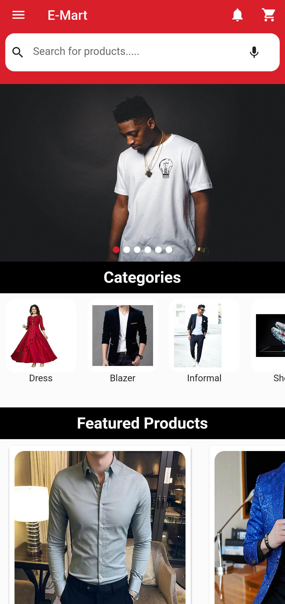
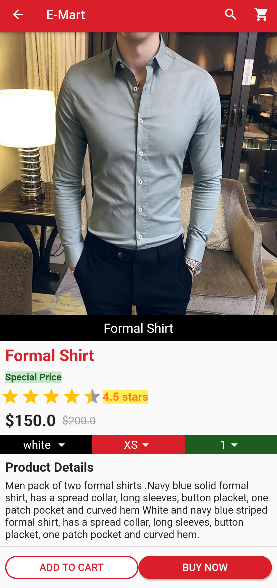
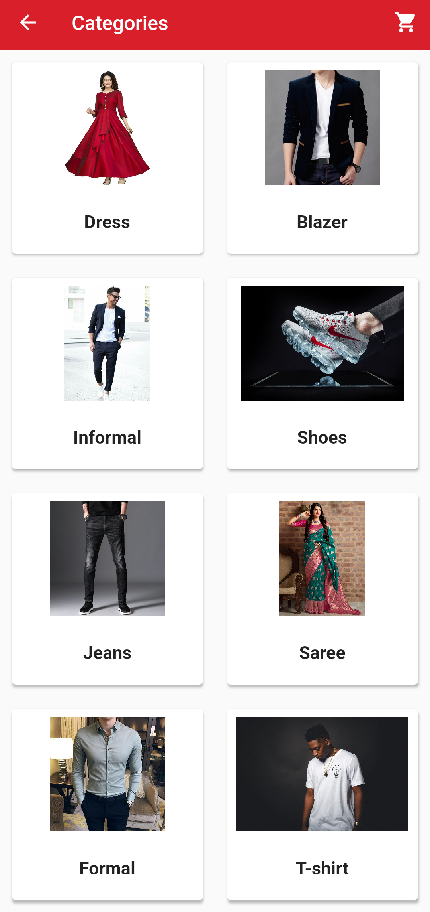
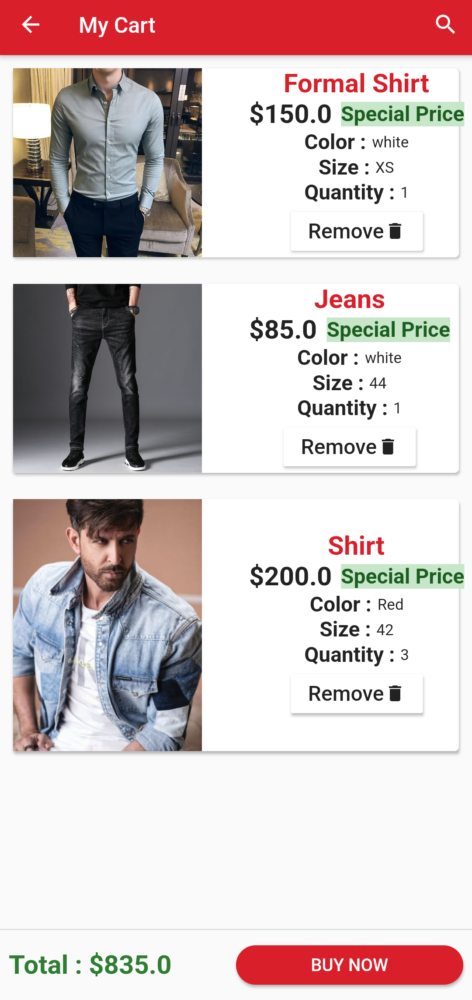
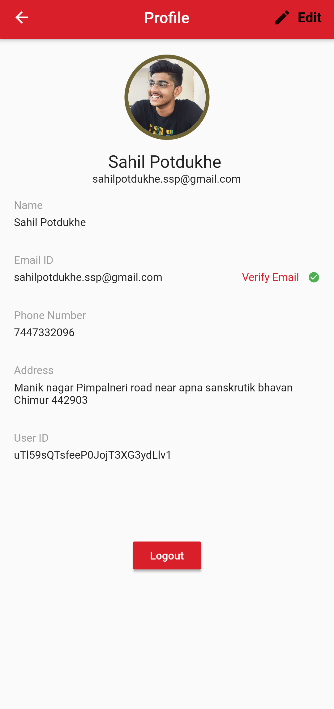
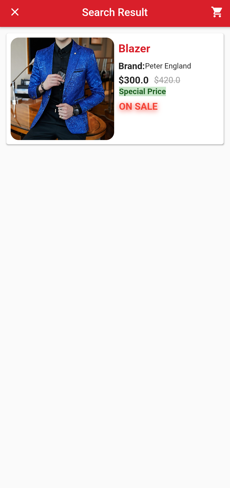
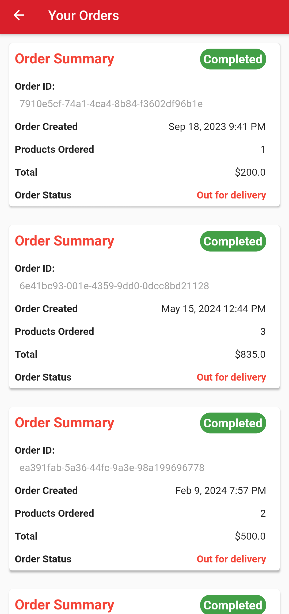
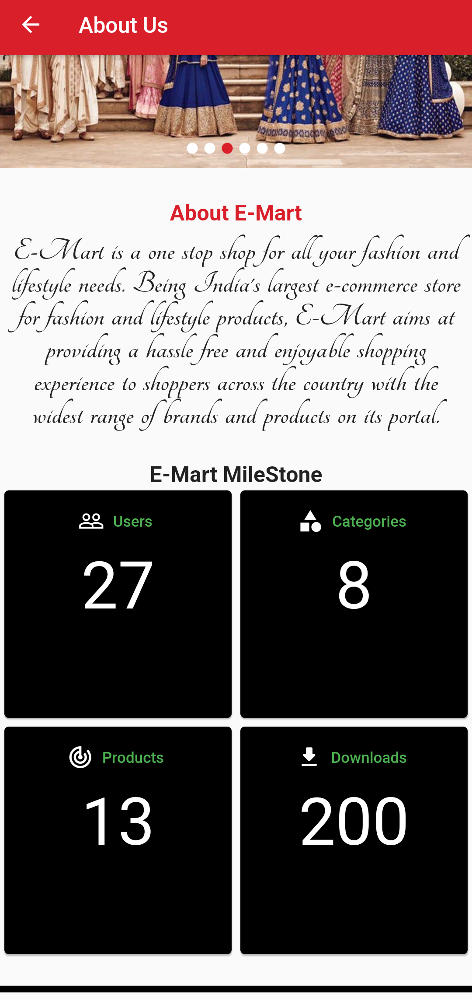
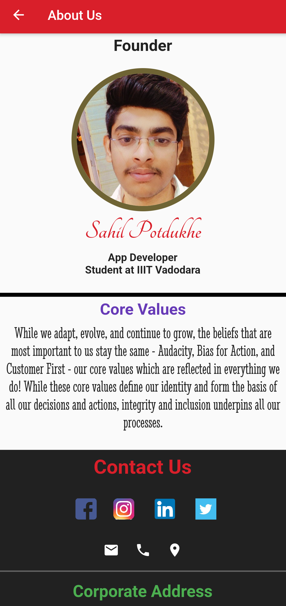

<!-- Project Title -->
<div align="center" style="display: flex; align-items: center; justify-content: center;">
  
</div>

<h1 align="center">E-Commerce App: Your One-Stop Shopping Destination</h1>


## 🔰 Project Overview
Welcome to our e-commerce app, designed to revolutionize your shopping experience! Similar to popular platforms like Flipkart, our app offers a comprehensive suite of features tailored to meet all your shopping needs. Whether you're browsing for the latest gadgets, trendy apparel, or essential household items, we've got you covered.

---
### 🎥 Simple demo


## ➤ Key Features

### 1. Feature-Rich Shopping Experience
- **Product Browsing:** Explore a vast array of products conveniently categorized for easy navigation.
- **Cart Management:** Seamlessly add desired items to your cart and manage them effortlessly.
- **Secure Checkout:** Experience peace of mind with our robust email authentication system ensuring secure transactions.

### 2. Enhanced User Interaction
- **Product Search:** Find exactly what you're looking for with our intuitive search functionality.
- **Order History:** Keep track of your purchases and review previous orders hassle-free.
- **User Profile Editing:** Personalize your experience by easily updating your profile details.

### 3. Empowering Administrators
- **Dedicated Admin App:** Manage products and gain valuable insights with our dedicated admin application.
- **Product Management:** Add new products effortlessly, ensuring a constantly updated catalog for users.
- **Analytics Dashboard:** Stay informed with real-time data on user engagement and product performance.


---
## 🛠 Technologies and Frameworks Used
-  Figma (for UI design)
-  Flutter Framework (Dart language)
-  Provider (for state management)

---
## ⚡Usage/Examples

```javascript
import 'package:flutter/material.dart';
void main() async {
  WidgetsFlutterBinding.ensureInitialized();
  await Firebase.initializeApp();
  runApp(MyApp());
}

//MyApp
class MyApp extends StatefulWidget {
  @override
  _MyAppState createState() => _MyAppState();
}

class ScreenController extends StatelessWidget {
  @override
  Widget build(BuildContext context) {
    final user =Provider.of<UserProvider>(context);
    switch(user.status){
      case Status.Uninitialized:
        return SplashScreen();
      case Status.Unauthenticated:
        return StartPage();
      case Status.Authenticating:
        return StartPage();
      case Status.Authenticated:
        return SplashScreen();
      default:return StartPage();
    }
  }
}
```

## 🚀 Installation

1. **Clone the repository:**

   ```bash
   git clone https://github.com/sahilpotdukhe/Flutter-Ecommerce-App.git
2. **Navigate to the project directory:**
    ```bash
    cd echat
3. **Install dependencies:**
    ```bash
    flutter pub get
4. **Run the app:**
    ```bash
    flutter run

## 📋 Requirements

- Flutter SDK: [Installation Guide](https://flutter.dev/docs/get-started/install)
- Figma Account: [Sign up for Figma](https://www.figma.com/)
- Firebase Account: [Sign up for Firebase](https://firebase.google.com/)

  ##  App Screens

<div align="center">
  <table style="border-collapse: collapse;">
    <tr>
      <td style="padding-right: 0px; border: none;">
        
        <p align="center">Home Screen</p>
      </td>
      <td style="padding-right: 0px; border: none;">
        
        <p align="center">ProductDetails Screen</p>
      </td>
      <td style="border: none;">
        
        <p align="center">Categories Screen</p>
      </td>
    </tr>
  </table>
</div>
<div align="center">
  <table style="border-collapse: collapse;">
    <tr>
      <td style="padding-right: 0px; border: none;">
        
        <p align="center">My Cart Screen</p>
      </td>
      <td style="padding-right: 0px; border: none;">
        
        <p align="center">Edit Profile</p>
      </td>
      <td style="border: none;">
        
        <p align="center">Search Screen</p>
      </td>
    </tr>
  </table>
</div>
<div align="center">
  <table style="border-collapse: collapse;">
    <tr>
      <td style="padding-right: 0px; border: none;">
        
        <p align="center">Order History</p>
      </td>
      <td style="padding-right: 0px; border: none;">
        
        <p align="center">About App</p>
      </td>
      <td style="border: none;">
        
        <p align="center">About Developer</p>
      </td>
    </tr>
  </table>
</div>

## 🤝 Contributing
Contributions are always welcome!
If you have a suggestion that would make this better, please fork the repo and create a pull request. Don't forget to give the project a star! Thanks again!
- Fork the Project
- Create your Feature Branch (```bash git checkout -b feature/AmazingFeature```)
- Commit your Changes (```bash git commit -m 'Add some AmazingFeature'```)
- Push to the Branch (```bash git push origin feature/AmazingFeature```)
- Open a Pull Request 


---
## ➤ Contact
You can reach out to me via the following methods:

- **Email:**  &nbsp;&nbsp;<a href="mailto:sahilpotdukhe.ssp@gmail.com">sahilpotdukhe.ssp@gmail.com
- **Social Media:**
   - &nbsp;&nbsp;[LinkedIn](https://www.linkedin.com/in/sahil-potdukhe/)
   - &nbsp;&nbsp;[GitHub](https://github.com/sahilpotdukhe)
   - &nbsp;&nbsp;[Instagram](https://www.instagram.com/sahilpotdukhe11/)
   - &nbsp;&nbsp;[Twitter](https://twitter.com/SahilPotdukhe)
  ---


